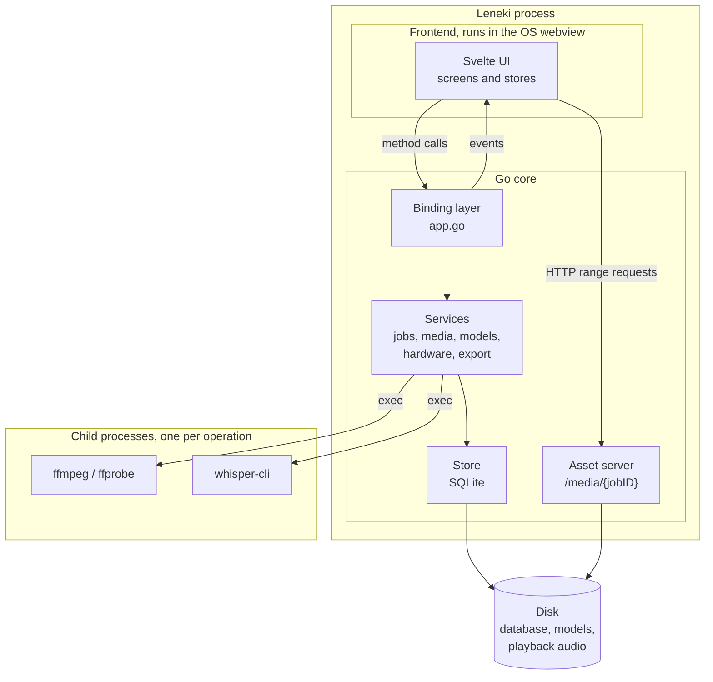

# Leneki Architecture, v1.0.0

**Status:** architecture of record for version 1.0.0
**Companion document:** [initial-plan.md](../initial-plan.md), which defines what gets built and in what order. This document defines how the pieces fit together.

---

## 1. What Leneki is

Leneki is a desktop application that turns audio and video recordings into accurate, editable text transcripts. It runs entirely on the user's own machine. Nothing is uploaded anywhere.

It does this by wrapping two well established command line tools, [whisper.cpp](https://github.com/ggerganov/whisper.cpp) for speech recognition and [FFmpeg](https://ffmpeg.org/) for media decoding, in a graphical application that a non-technical person can install and use without ever seeing a terminal.

### The four constraints

Every decision in this document follows from these four constraints. When a tradeoff appears later in the document, this is the list it is being weighed against.

| Constraint | What it rules out |
|---|---|
| **Fully offline.** Transcription must work with the network cable unplugged. | Any cloud API, any telemetry, any runtime dependency on a remote service. |
| **Single installable file.** The user downloads one thing and it works. | Asking users to install Python, FFmpeg, or model weights themselves. |
| **Non-technical user.** The target user does not know what a "model" is. | Error messages that surface exit codes. Settings that require understanding inference. |
| **Four platform targets.** Windows x64, macOS ARM64, macOS x64, Linux x64. | Anything that only works on one platform without a designed fallback for the others. |

### Terms used in this document

Defined here so the rest of the document can move quickly.

- **Job**: one source file moving through the pipeline, from the moment the user adds it to the moment it has a finished transcript.
- **Segment**: one timestamped chunk of transcript text, typically a sentence or clause. Whisper produces these natively. A one hour recording produces roughly 600 to 900 of them.
- **Model**: the speech recognition weights file, from `tiny` at 75MB to `large-v3` at 3GB. Larger is more accurate and slower.
- **Real-time factor (RTF)**: how long transcription takes relative to the audio length. An RTF of 0.1 means one hour of audio takes six minutes.
- **Webview**: the operating system's built-in browser engine, which renders the user interface. WebView2 on Windows, WebKit on macOS, WebKitGTK on Linux.
- **Binding**: a Go method that the JavaScript frontend can call directly, generated by Wails.

---

## 2. System overview

Leneki is one operating system process that owns all state, plus short lived child processes that do the heavy work.



Reading the diagram: the frontend never touches the disk, never spawns a process, and holds no authoritative state. It calls bound Go methods and renders whatever events come back. Everything else lives in the Go core.

---

## 3. Technology choices

### Go for the core

Go compiles to a single static binary with no runtime to install, which is the whole reason the "single installable file" constraint is achievable. It also has good process control in the standard library, which matters because the entire pipeline is built on running child processes and cancelling them cleanly.

Rejected: Python, because shipping a Python application to non-technical users means bundling an interpreter and fighting with PyInstaller. Rust, because Go's simpler concurrency model is enough here and the contributor pool is larger.

### Wails v2 for the desktop shell

[Wails](https://wails.io/) puts a Go program behind the operating system's own webview and generates typed bindings between them. Because it uses the system webview rather than bundling Chromium, the installed application is tens of megabytes rather than hundreds.

Rejected: Electron, which would add roughly 150MB and a Node runtime. Native toolkits per platform, which would mean writing the transcript editor three times.

Wails has one significant cost, covered in [section 14](#14-build-signing-and-distribution): it cannot cross compile.

### Svelte with TypeScript and Vite for the frontend

The transcript view is the product. It needs a virtualized list of thousands of editable rows staying in sync with an audio player, at 60 frames per second, inside three different webview engines including WebKitGTK, which is the slowest of them. Svelte compiles away its framework overhead, which is worth real frames on that screen.

TypeScript is not optional here because Wails generates TypeScript definitions for every bound method and event payload. That generated file is the contract between the two halves of the application, and it only helps if the frontend is type checked.

### SQLite for storage

Transcripts are structured, queryable, and need to survive a crash mid-edit. The build plan already locks in storing segments as individual records rather than one text blob, so that Phase 2 full text search can return a timestamp rather than a document. That is a database, so use one.

Driver: `modernc.org/sqlite`, a pure Go translation of SQLite with no C dependency. It supports FTS5, which Phase 2 search needs. The alternative, `mattn/go-sqlite3`, requires cgo, and while Wails already pulls in cgo on macOS and Linux, adding a second cgo dependency makes the Windows build harder for no gain.

Rejected: flat JSON files, which lose the ability to search and make partial updates during autosave awkward.

### Bundled binaries rather than library bindings

Both FFmpeg and whisper.cpp are invoked as child processes rather than linked as libraries. The reasoning is in [section 4](#4-runtime-and-process-model).

---

## 4. Runtime and process model

### One process owns all state

The Go core is the single source of truth for the job queue, transcript contents, settings, and model inventory. The frontend holds a copy for rendering and nothing more. If the frontend and the core ever disagree, the core is right.

This matters because the webview can be reloaded, and on some platforms it can crash independently of the host process. When that happens the application should recover by re-reading state from the core, not by losing the user's queue.

### Child processes rather than in-process libraries

Whisper and FFmpeg run as separate executables, invoked with `exec.CommandContext`. This costs some fine grained control over the inference context. In exchange it buys three things that matter more:

1. **Crash isolation.** Inference on a large model with insufficient RAM can abort the process. When that happens, the user sees a readable error and their queue survives, because the thing that died was a child process and not the application.
2. **Cancellation is trivial.** Cancelling a job is killing a process. There is no cooperative cancellation to plumb through a library's callback API.
3. **No cgo bindings to maintain.** whisper.cpp's API changes between releases. Pinning to a released `whisper-cli` executable and parsing its documented output is a smaller ongoing maintenance burden than maintaining bindings.

### Concurrency

One transcription job runs at a time. Parallel jobs compete for the same RAM and the same GPU, and in most cases finish slower in aggregate than running in sequence, while making progress reporting confusing. Whisper is given multiple threads via its `-t` flag, defaulting to `runtime.NumCPU()`, so the machine is still fully used.

Model downloads run concurrently with transcription. They are network bound and do not compete for the same resource.

Inside the Go core:

- One long lived **queue worker** goroutine drains the job queue.
- Each running job holds a `context.CancelFunc` in its record, so pause and cancel work from any goroutine.
- Each running child process has two goroutines reading its stdout and stderr.
- The store is guarded by SQLite's own locking with WAL mode enabled, plus a single writer connection to avoid busy timeouts.

---

## 5. Repository layout

```
leneki/
  main.go                  Wails setup, dependency wiring, asset server registration
  app.go                   Binding layer: every method the frontend can call
  internal/
    apperr/                Typed error with a stable code and a user readable message
    binaries/              Embed, extract, and verify whisper-cli, ffmpeg, ffprobe
    config/                Settings and per OS directory resolution
    events/               Event names, payload types, and the Emitter interface
    export/                TXT, SRT, VTT, JSON writers plus subtitle re-breaking
    hardware/              RAM, CPU, GPU detection, benchmark, time estimates
    jobs/                  Queue, state machine, orchestration, persistence
    media/                 ffprobe inspection, WAV conversion, playback encoding
    models/                Catalog, resumable download, checksum verify, delete
    store/                 SQLite connection, migrations, repositories
    transcribe/            One whisper-cli invocation and its output parsing
  frontend/
    src/
      lib/                 Reusable components
      routes/              Screens
      stores/              Frontend state
      api/                 Thin wrappers over generated Wails bindings
  assets/
    bench-sample.wav       30 second benchmark audio
    binaries/              Per platform third party executables, checked in or fetched at build
  build/                   Wails packaging config, icons, installer scripts
  documents/               Plans and architecture
```

---

## 6. Layering rules

Four layers, and dependencies only ever point downward.

```
frontend  ->  binding layer (app.go)  ->  services (internal/*)  ->  store and exec
```

Three rules enforce this.

**Rule 1: services never import the Wails runtime.** A service that needs to report progress takes an `events.Emitter` interface:

```go
package events

type Emitter interface {
    Emit(name string, payload any)
}
```

`main.go` injects the Wails-backed implementation. Tests inject a recording implementation. The practical effect is that the entire pipeline can be exercised in `go test` with no webview and no display server, which is what makes the two large milestones tractable.

**Rule 2: the binding layer contains no logic.** `app.go` methods validate their arguments, call one service, and translate errors. When a bound method starts making decisions, that decision belongs in a service.

**Rule 3: services do not import each other except through explicit dependencies passed at construction.** `jobs` depends on `media` and `transcribe` because it orchestrates them, and receives them as interfaces. Nothing depends on `jobs`.

---

## 7. Package contracts

The exported surface of each service. Signatures are indicative rather than final, but the boundaries are the commitment.

### internal/binaries

Owns the bundled executables. Uses `go:embed` to carry the platform's `whisper-cli`, `ffmpeg`, and `ffprobe` inside the Go binary, extracts them to the cache directory on first run, sets the executable bit on Unix, and verifies SHA256 on every launch so a corrupted or partial extract self-heals rather than failing mysteriously later.

```go
func Ensure(cacheDir string) (Paths, error)  // extract if needed, verify, return absolute paths
type Paths struct { Whisper, FFmpeg, FFprobe string }
```

### internal/media

```go
func Probe(ctx, ffprobe, path string) (Info, error)
func ConvertForTranscription(ctx, ffmpeg, src, dstWAV string, track int) error
func EncodePlayback(ctx, ffmpeg, src, dstWebM string, track int) error
```

`Probe` runs first, always, and returns duration, the list of audio streams, codecs, and sample rate. Every failure case listed in the build plan is detected here and returned as a typed error, before any expensive work starts.

`ConvertForTranscription` produces 16kHz mono WAV, which is the only input whisper accepts, into the temp directory keyed by job ID.

`EncodePlayback` produces the file the transcript player uses. See [section 12](#12-frontend-architecture) for why it exists.

### internal/models

```go
func Catalog() []ModelSpec                        // static, compiled in
func Installed(ctx) ([]InstalledModel, error)
func Download(ctx, spec, dir string, em events.Emitter) error   // resumable, verified
func Delete(ctx, name string) error               // refuses if in use
func FreeSpace(dir string) (uint64, error)
```

The catalog is static data compiled into the binary: name, URL, byte size, SHA256, approximate RAM requirement, relative speed factor. Model weights are never bundled in the installer.

Downloads are resumable via HTTP `Range` requests against a partial file, because the largest model is 3GB and the audience includes people on unreliable connections. On completion the file is verified by SHA256 before being moved into place, so a truncated download can never masquerade as a working model.

### internal/hardware

```go
func Detect() (Machine, error)              // RAM, cores, GPU, fingerprint
func Benchmark(ctx, whisper, model, sample string) (RTF float64, err error)
func Estimate(rtf float64, m ModelSpec, audioSeconds float64) time.Duration
```

Detection alone is a weak predictor of speed, so first run transcribes the bundled 30 second sample with the `base` model and measures the real RTF for this specific machine. Other models are extrapolated from that measurement using the catalog's relative speed factors.

The result is cached against a machine fingerprint derived from CPU model, core count, and GPU identity. If the fingerprint changes, for example because the user installed a graphics card, the benchmark re-runs. Settings also exposes a manual re-run.

### internal/jobs

Owns the queue, the state machine, and all persistence of job state. This is the orchestrator: it calls `media` and then `transcribe`, and writes the result through `store`.

```go
func (q *Queue) Add(ctx, sourcePath string, opts Options) (Job, error)
func (q *Queue) Cancel(ctx, id string) error
func (q *Queue) Pause(ctx, id string) error
func (q *Queue) Resume(ctx, id string) error
func (q *Queue) Reorder(ctx, id string, position int) error
func (q *Queue) Recover(ctx) error   // called at startup
```

### internal/transcribe

Wraps exactly one `whisper-cli` invocation. It knows nothing about queues, databases, or other jobs, which is what makes the largest milestone testable in isolation.

```go
func Run(ctx, cfg Config, onSegment func(Segment)) (Result, error)
```

See [section 8](#8-job-lifecycle) for how its output is consumed.

### internal/export

```go
func WriteTXT(w io.Writer, segs []Segment, opts TXTOptions) error
func WriteSRT(w io.Writer, cues []Cue) error
func WriteVTT(w io.Writer, cues []Cue) error
func WriteJSON(w io.Writer, job Job, segs []Segment) error

func RawCues(segs []Segment) []Cue                        // one cue per segment
func FormatCues(segs []Segment, opts SubtitleOptions) []Cue // re-broken for subtitling
```

The split between `RawCues` and `FormatCues` is deliberate. Both SRT and VTT writers take `[]Cue` and do not care where the cues came from, so subtitle formatting is one component feeding two writers rather than logic duplicated in each.

Both cue paths ship in v1. The build plan leaves this open, on the grounds that raw segment SRT is adequate for journalists and close to worthless for video editors. Leneki targets both audiences, so it ships both: raw segment cues, and a formatted option applying character-per-line caps, minimum and maximum cue durations, reading speed limits, and break points at punctuation.

### internal/store

Owns the database. Exposes repositories rather than a raw connection, so no service writes SQL of its own.

```go
func Open(path string) (*Store, error)   // opens, sets WAL, runs migrations
func (s *Store) Jobs() JobRepo
func (s *Store) Segments() SegmentRepo
func (s *Store) Models() ModelRepo
func (s *Store) Settings() SettingsRepo
```

### internal/config

Resolves per OS directories ([section 10](#10-file-system-layout)) and reads and writes user settings. Settings live in the database rather than a separate file, so there is one thing to back up and one thing to migrate.

---

## 8. Job lifecycle

### State machine

```
queued ──> converting ──> transcribing ──> done
              │                │
              ├──> failed <────┤
              └─> cancelled <──┘
```

`paused` is a flag on a `queued` job rather than a state, because pausing an already running job would mean suspending whisper mid-inference, which whisper does not support. Pausing a running job cancels it and returns it to `queued`. The user interface says so plainly.

### Who owns each transition

| Transition | Trigger | Persisted before the transition is announced |
|---|---|---|
| to `queued` | user adds a file | job row with source path, options, queue position |
| to `converting` | queue worker picks it up | `started_at`, state |
| to `transcribing` | conversion succeeded | state, media duration from probe |
| to `done` | whisper exited 0 and JSON was read | all segment rows, then `finished_at` and state, in one transaction |
| to `failed` | any error | error code, user message, state |
| to `cancelled` | user cancel | state, then temp file cleanup |

State is written to the database before the corresponding event is emitted. A crash between the two is recoverable; a crash the other way around would show the user a state the disk does not agree with.

### Transcription output is read on two channels

This is the one piece of the pipeline worth describing in detail, because it is not obvious from the outside.

`whisper-cli` is invoked with JSON output enabled. Two things are then read from it:

1. **stdout, line by line, while it runs.** Whisper prints each segment as it completes, in the form `[00:00:12.400 --> 00:00:16.120]   text here`. Parsing these gives live text on screen while the job runs. A twenty minute job that shows text appearing feels alive. One that shows a spinner feels frozen, and users kill it.
2. **The JSON output file, once the process exits cleanly.** This is the authoritative record. It carries exact timings, word level timestamps, and the detected language, and it is what gets persisted.

The live channel is for perceived responsiveness and is allowed to be approximate. The JSON channel is for correctness. Segments displayed from stdout are replaced by the JSON contents when the job completes.

### Event batching

Segments are not emitted to the frontend one at a time. They accumulate in a buffer that flushes on a 100 millisecond tick, or when it reaches 25 segments, whichever comes first.

A four hour recording produces several thousand segments. Each individual crossing of the Go to JavaScript bridge is cheap, but several thousand of them arriving in bursts causes visible jank in the webview, worst on WebKitGTK. Batching removes that at the cost of at most 100 milliseconds of latency, which is imperceptible.

### Startup recovery

On launch, `jobs.Recover` finds every job left in `converting` or `transcribing`, which can only happen after a crash or a force quit, and returns them to `queued`. It then sweeps the temp directory for orphaned WAV files whose job ID no longer corresponds to an active job.

---

## 9. Data model

SQLite, WAL mode, one writer connection.

```sql
CREATE TABLE jobs (
    id              TEXT PRIMARY KEY,       -- UUID
    source_path     TEXT NOT NULL,
    display_name    TEXT NOT NULL,
    state           TEXT NOT NULL,          -- queued|converting|transcribing|done|failed|cancelled
    queue_position  INTEGER NOT NULL,
    paused          INTEGER NOT NULL DEFAULT 0,
    model_name      TEXT NOT NULL,
    language        TEXT,                   -- NULL means auto detect
    detected_lang   TEXT,                   -- what whisper actually found
    translate       INTEGER NOT NULL DEFAULT 0,
    audio_track     INTEGER NOT NULL DEFAULT 0,
    duration_ms     INTEGER,
    playback_path   TEXT,                   -- the Opus file, NULL until encoded
    error_code      TEXT,
    error_message   TEXT,
    created_at      INTEGER NOT NULL,
    started_at      INTEGER,
    finished_at     INTEGER
);

CREATE TABLE segments (
    id          INTEGER PRIMARY KEY,
    job_id      TEXT NOT NULL REFERENCES jobs(id) ON DELETE CASCADE,
    idx         INTEGER NOT NULL,           -- position within the job
    start_ms    INTEGER NOT NULL,
    end_ms      INTEGER NOT NULL,
    text        TEXT NOT NULL,
    words_json  TEXT,                       -- word level timings, JSON array
    edited      INTEGER NOT NULL DEFAULT 0,
    UNIQUE (job_id, idx)
);
CREATE INDEX idx_segments_job_start ON segments (job_id, start_ms);

CREATE TABLE installed_models (
    name         TEXT PRIMARY KEY,
    path         TEXT NOT NULL,
    size_bytes   INTEGER NOT NULL,
    sha256       TEXT NOT NULL,
    installed_at INTEGER NOT NULL
);

CREATE TABLE benchmark (
    fingerprint TEXT PRIMARY KEY,
    rtf_base    REAL NOT NULL,              -- measured with the base model
    cpu         TEXT NOT NULL,
    gpu         TEXT,
    ram_bytes   INTEGER NOT NULL,
    ran_at      INTEGER NOT NULL
);

CREATE TABLE settings (
    key   TEXT PRIMARY KEY,
    value TEXT NOT NULL
);
```

### Why segments are rows

This is the build plan's most consequential early decision and it is worth restating. Storing the transcript as one text blob would be simpler today and would make Phase 2 search useless, because a search hit needs to return a timestamp the user can click, not a document. Retrofitting this after people have data in the application is a migration nobody enjoys writing.

### Why word timings are a JSON column

Word level timings are read by exactly one thing, the JSON exporter. A four hour recording contains on the order of 40,000 words, so a separate `words` table would be hundreds of thousands of rows across a modest library, indexed and joined, to serve one export path that always wants them grouped by segment anyway. A JSON column on the row that owns them is the right size for the job. If a future feature needs to query individual words, that is the point to normalize.

### Migrations

Numbered SQL files under `internal/store/migrations/`, embedded with `go:embed`, applied in order on open, tracked with `PRAGMA user_version`. No migration framework. Migrations are forward only, and the application refuses to open a database whose `user_version` is higher than it knows about, rather than corrupting it.

---

## 10. File system layout

Two locations, distinguished by whether losing the contents costs the user anything.

| Purpose | Contents | Losing it means |
|---|---|---|
| **Data directory** | database, downloaded models, playback audio | losing transcripts and re-downloading gigabytes |
| **Cache directory** | extracted binaries, temp WAVs | a few seconds of re-extraction |

Resolved with `os.UserConfigDir` and `os.UserCacheDir`:

| Platform | Data | Cache |
|---|---|---|
| Windows | `%APPDATA%\Leneki` | `%LOCALAPPDATA%\Leneki\Cache` |
| macOS | `~/Library/Application Support/Leneki` | `~/Library/Caches/Leneki` |
| Linux | `~/.local/share/Leneki` | `~/.cache/Leneki` |

Layout within each:

```
<data>/
  leneki.db
  models/            ggml-base.bin, ggml-small.bin, ...
  playback/          <jobID>.webm

<cache>/
  bin/               whisper-cli, ffmpeg, ffprobe  (extracted, verified)
  temp/<jobID>/      audio.wav, out.json           (deleted on job completion)
```

Both the model directory and the temp directory are overridable in settings, because users with small system drives will want models on an external one.

### Cleanup rules

- Temp WAV and JSON are deleted when a job reaches `done`, `failed`, or `cancelled`.
- The whole temp directory is swept at startup for orphans left by a crash.
- Playback audio is deleted only when the user deletes the job.
- Models are deleted only on explicit user action, and never while in use.

---

## 11. Frontend and backend contract

### Bound methods

Grouped by service. Every one of them can fail, and every failure arrives as a typed error ([section 13](#13-error-model)).

```
Jobs      AddJob(paths []string, opts Options) []Job
          CancelJob(id) / PauseJob(id) / ResumeJob(id) / ReorderJob(id, pos)
          DeleteJob(id)
          ListJobs() []Job
          GetJob(id) Job
          GetSegments(id) []Segment
          UpdateSegment(segmentID, text)          // called by autosave
          ReplaceAll(jobID, find, replace, opts) int

Models    ListModels() []ModelStatus              // catalog joined with installed
          DownloadModel(name) / CancelDownload(name) / DeleteModel(name)
          FreeSpace() uint64

Hardware  GetMachine() Machine
          RunBenchmark()
          EstimateFor(modelName, audioSeconds) int   // seconds

Media     ProbeFile(path) Info                    // used by the drop zone before adding

Export    ExportJob(jobID, format, path, opts)
          CopyTranscript(jobID) string

Config    GetSettings() Settings
          UpdateSettings(Settings)
```

### Events

Names are namespaced with a colon. Payloads are Go structs, which Wails mirrors into TypeScript definitions, so the contract is type checked on both sides.

| Event | Payload | When |
|---|---|---|
| `job:state` | `{id, state, error?}` | any state transition |
| `job:progress` | `{id, percent, etaSeconds}` | roughly every second while running |
| `job:segments` | `{id, segments[]}` | on the 100ms batch flush |
| `job:done` | `{id}` | segments persisted, job complete |
| `queue:changed` | `{jobs[]}` | add, remove, reorder |
| `model:progress` | `{name, bytesDone, bytesTotal}` | during download, throttled to 4Hz |
| `model:done` | `{name}` | verified and installed |
| `model:error` | `{name, code, message}` | download or verification failed |
| `bench:progress` | `{stage}` | during first run benchmark |
| `bench:done` | `{machine, rtf, estimates[]}` | benchmark complete |

### The media route

Audio playback does not go through bindings. Wails' asset server is given a custom handler at `/media/{jobID}` which resolves the job's `playback_path` and serves it with `http.ServeContent`.

`http.ServeContent` handles HTTP range requests, which is what makes seeking work. Without range support the webview would have to download the whole file before it could play from the middle, and clicking a segment 90 minutes into a recording would stall. It also means the file streams from disk rather than being loaded into memory.

---

## 12. Frontend architecture

### Screens

| Screen | Purpose |
|---|---|
| First run | Benchmark, model recommendation, first download |
| Home | Drop zone and recent jobs |
| Queue | All jobs with state, progress, and per job controls |
| Transcript | The editor. See below. |
| Models | Install, switch, delete, with disk space and time estimates |
| Settings | Directories, thread count, re-run benchmark |
| About | Version, license, third party attributions |

### Stores

Svelte stores mirroring backend state: `jobs`, `activeJob`, `segments`, `models`, `machine`, `settings`. Each subscribes to its events on mount and reconciles. No store writes to disk; every mutation goes through a bound method and is confirmed by the resulting event.

### The transcript view

This screen is the product, and three parts of it need deliberate design.

**Virtualized list.** A four hour recording is roughly 3,000 segments. Rendering them all produces a slow scroll on WebKitGTK and high memory use everywhere. Only the visible window plus a margin is rendered. Because rows are editable and therefore variable height, rendered heights are measured and cached, with an estimate used for unmeasured rows.

**Playback.** An HTML `<audio>` element pointed at `/media/{jobID}`. During playback the current segment is highlighted and scrolled into view unless the user has scrolled away. Clicking a segment sets `currentTime`.

The playback file is a separate small Opus in WebM copy produced during conversion, and it exists for two reasons. First, the 16kHz WAV that whisper consumes is deleted on completion and would otherwise cost about 115MB per hour to keep. Second, playing the original source file is not safe: WebKitGTK on Linux frequently ships without AAC or H.264 decoders, so MP4 and M4A sources would play on Windows and macOS and silently fail on Linux. Opus in WebM is royalty free and decodes in all three webviews. At 32kbps mono it costs about 14MB per hour.

**Editing.** Text is edited inline. Changes are debounced 500 milliseconds and written through `UpdateSegment`, which sets the segment's `edited` flag. Undo and redo are a command stack held in the frontend, scoped to the open job and cleared when it closes. Find and replace operates across the whole transcript through `ReplaceAll`, which does the work in one transaction in the backend rather than issuing one update per match.

Find and replace is treated as core rather than a nice to have because correcting a name that whisper misspelled forty times is the single most common task after transcription. Without it, users finish the job in a text editor, and then they have no reason to come back.

---

## 13. Error model

One error type, carrying a stable machine readable code and a message written for a person.

```go
package apperr

type Error struct {
    Code    string   // stable, e.g. "MEDIA_NO_AUDIO_STREAM"
    Message string   // written for a non-technical user
    Cause   error    // logged, never shown
}
```

The binding layer converts any error crossing into the frontend. Anything that is not an `apperr.Error` becomes `INTERNAL` with a generic message, and the real cause goes to the log file. Users never see an exit code or a stack trace.

Codes for the failure cases the build plan calls out explicitly:

| Code | Cause | What the user is told |
|---|---|---|
| `MEDIA_NO_AUDIO_STREAM` | file has video only | "This file has no audio to transcribe." |
| `MEDIA_CORRUPT` | container unreadable or truncated | "This file appears to be damaged and cannot be read." |
| `MEDIA_DRM_PROTECTED` | copy protected media | "This file is copy protected and cannot be opened." |
| `MEDIA_UNSUPPORTED` | no decoder | "This file format is not supported." |
| `DISK_INSUFFICIENT_SPACE` | not enough room to convert | "Not enough disk space. This file needs about 350MB free." |
| `MODEL_NOT_INSTALLED` | selected model missing | "That model has not been downloaded yet." |
| `MODEL_CHECKSUM_MISMATCH` | verification failed | "The download was damaged. Try again." |
| `MODEL_IN_USE` | delete attempted on active model | "This model is in use and cannot be removed." |
| `TRANSCRIBE_OUT_OF_MEMORY` | whisper aborted | "Not enough memory for this model. Try a smaller one." |
| `TRANSCRIBE_FAILED` | non-zero exit, other | "Transcription failed. The details are in the log." |
| `NETWORK_UNAVAILABLE` | download could not start | "Could not reach the download server. Check your connection." |

The rule the build plan sets is worth keeping visible: every one of these must produce a readable message at the point of failure, not a crash three steps later.

---

## 14. Build, signing, and distribution

### Wails cannot cross compile

The build plan states that shelling out to child processes keeps the project pure Go so that `GOOS=darwin GOARCH=arm64 go build` works from any CI runner. That holds for the Go core in isolation, but not for the packaged application: Wails binds to each platform's native webview through cgo on macOS and Linux, and packaging needs each platform's own toolchain. This is a correction to the build plan, and it changes CI from one runner to four.

### CI matrix

| Target | Runner | Output |
|---|---|---|
| Windows x64 | `windows-latest` | NSIS installer, signed |
| macOS ARM64 | `macos-14` | `.app` in a `.dmg`, signed and notarized |
| macOS x64 | `macos-13` | `.app` in a `.dmg`, signed and notarized |
| Linux x64 | `ubuntu-22.04` | AppImage |

Each runner builds, packages, signs, and uploads its own artifact. Distribution is solved in the first milestone rather than the last, because an application that is 90 percent complete and cannot be installed is 0 percent shipped.

### Per platform notes

**Windows.** Unsigned installers trigger SmartScreen, and a non-technical audience does not click through that warning. An Organization Validation certificate builds reputation over time; an Extended Validation certificate bypasses the warning immediately and costs more. Either way this is a budget line, not a technical problem. The installer is tested on a clean virtual machine, since the build machine never reproduces the warning.

**macOS.** Signed with a Developer ID certificate, then notarized with `notarytool` and stapled. Without notarization Gatekeeper refuses to open the application at all on a default configuration. Two separate builds rather than a universal binary, because the bundled whisper and FFmpeg executables would otherwise need `lipo` merging as well.

**Linux.** AppImage. The runtime dependency on `libwebkit2gtk` cannot be bundled and must be documented prominently in the README. Ubuntu 22.04 provides `webkit2gtk-4.0` and 24.04 provides `4.1`, so the build uses the appropriate Wails build tag and the README names the package for each.

### Installer size

Roughly 60 to 80MB, dominated by FFmpeg. This is accepted deliberately. The alternative, downloading the helper binaries on first run, moves a failure mode to the worst possible moment: the first thirty seconds a new user spends with the application.

---

## 15. Third party binaries and licensing

Leneki itself is Apache 2.0. It ships two third party executables.

| Component | License | Obligation |
|---|---|---|
| whisper.cpp (`whisper-cli`) | MIT | Include the license text |
| FFmpeg (`ffmpeg`, `ffprobe`) | LGPL 2.1 or GPL 2.0 depending on build | Include the license text and a written offer for the corresponding source |
| Whisper model weights | MIT, downloaded not bundled | Attribute in the About screen |

FFmpeg is invoked as a separate executable and is not linked into the Go binary. That is aggregation rather than linking, so bundling it does not impose FFmpeg's license terms on Leneki's own Apache 2.0 code. The obligations that do apply are to ship the license text and to point to the exact source revision of the build being distributed.

Practically: pin exact versions of both executables, record their SHA256 in `internal/binaries`, ship their licenses in `assets/licenses/`, and list them in the About screen with a link to the source.

---

## 16. Security and privacy

- **No telemetry.** No analytics, no crash reporting, no update pings. The absence is the feature.
- **Network egress is limited to model downloads**, over HTTPS, from URLs in the compiled catalog. There is no code path that sends user audio or transcripts anywhere.
- **Downloads are verified by SHA256** before use, so a compromised mirror cannot deliver a substituted file unnoticed.
- **Bundled executables are verified by SHA256** on every launch before being run.
- **User files are read, never modified.** Source media is opened read only. Everything Leneki writes goes in its own directories.
- **The database is not encrypted.** Transcripts sit at rest in the user's own data directory with normal file permissions, the same as a document folder. Encryption at rest is a reasonable future request and is not in v1.

---

## 17. Testing strategy

Three tiers, distinguished by what they need in order to run.

**Unit tests, no external dependencies.** State machine transitions, SRT and VTT and JSON writers, subtitle re-breaking, whisper stdout line parsing against captured fixture output, time estimate arithmetic, error mapping, migrations against a temp database. This is the bulk of the suite and it runs everywhere in under a second.

**Integration tests, need the bundled binaries.** Probe and convert against a small set of committed fixture media: a normal MP4, an M4A, an MP3, a video only file, a truncated file, and a multi-track file. These prove the media milestone's own done criterion, which is that all six produce correct behaviour rather than a crash.

**Manual, need a real machine and a real display.** Benchmark accuracy, GPU detection paths, playback and seeking in each of the three webviews, virtualized list performance on a four hour transcript, installer behaviour on a clean virtual machine per platform.

The layering rules in [section 6](#6-layering-rules) exist to keep the first tier as large as possible. Because services take an `events.Emitter` rather than importing the Wails runtime, a full job can be driven through conversion, transcription, and persistence inside `go test` with no window on screen.

---

## 18. Milestone traceability

Every milestone in the build plan maps to named components here.

| Milestone | Components |
|---|---|
| 0. Skeleton and distribution | `main.go`, `internal/binaries`, `internal/config`, CI matrix ([section 14](#14-build-signing-and-distribution)) |
| 1. Media intake | `internal/media`, error codes ([section 13](#13-error-model)), cleanup rules ([section 10](#10-file-system-layout)) |
| 2. Model management | `internal/models`, `installed_models` table, `model:*` events |
| 3. Hardware benchmark | `internal/hardware`, `benchmark` table, first run screen |
| 4. Transcription pipeline | `internal/jobs`, `internal/transcribe`, `jobs` table, [section 8](#8-job-lifecycle) |
| 5. Transcript view | Transcript screen, `segments` table, `/media/{jobID}` route, `UpdateSegment`, `ReplaceAll` |
| 6. Export | `internal/export`, both cue paths ([section 7](#internalexport)) |
| 7. Language handling | `jobs.language`, `jobs.detected_lang`, `jobs.translate` |
| 8. Polish | Error model, `jobs.Recover`, Settings and About screens |

---

## 19. Out of scope for v1

Named here so that a contributor knows a gap is intentional rather than forgotten. Each is a Phase 2 candidate.

Speaker diarization. Searchable transcript library with full text search. Custom vocabulary and prompt biasing. Voice activity detection. Live microphone capture. Summarization. Any cloud feature. Automatic updates. Localization of the interface itself, as distinct from the ninety plus transcription languages, which are in v1.

Two v1 decisions are made specifically to keep Phase 2 cheap: segments stored as rows so FTS5 search can return timestamps, and `store` exposing repositories so a search index can be added without touching services.

---

## 20. Open risks

| Risk | Response |
|---|---|
| **WebKitGTK differs from the other two webviews.** It is the slowest, has the least consistent media codec support, and has its own layout quirks. | Test the transcript view on Linux from the first week rather than the last. Opus in WebM was chosen for playback specifically because of its codec gaps. Virtualization is designed against its performance, not Chromium's. |
| **Windows SmartScreen flags unsigned installers.** The target audience will not click through the warning. | A budget decision, not a technical one. Either buy a certificate or accept the friction knowingly. Test on a clean virtual machine, since the build machine never shows the warning. |
| **Long recordings produce large transcripts.** Four hours is roughly 3,000 segments. | Virtualized list, batched segment events, indexed segment queries, streamed playback via range requests. |
| **Model downloads fail on unreliable connections.** The largest model is 3GB. | Resumable transfer with SHA256 verification is a requirement, not an enhancement. A failed download resumes rather than restarting. |
| **Benchmark misleads on battery.** Laptops throttle, so a benchmark run while plugged in overestimates speed on battery. | State it in the interface next to the estimate. Do not attempt to detect and model power state in v1. |
| **whisper.cpp output format changes between releases.** The stdout parser depends on a documented but informal format. | Pin the executable version. The parser only feeds the live display; the authoritative JSON path is more stable, and a parser break degrades the experience rather than corrupting data. |

---

## 21. Decisions locked

The build plan lists four decisions to settle before writing code. All four are settled here, plus three that surfaced while writing this document.

| Decision | Choice |
|---|---|
| Binary bundling | Embed with `go:embed`, extract to cache on first run, verify SHA256 every launch |
| Segment storage | Individual rows, never a blob |
| Subtitle formatting | In v1, because the audience includes video editors |
| Default concurrency | One transcription job at a time, multi-threaded within the job |
| Playback audio | A separate 32kbps mono Opus in WebM copy per job |
| SQLite driver | `modernc.org/sqlite`, pure Go |
| Word timings | JSON column on the segment row, not a separate table |
