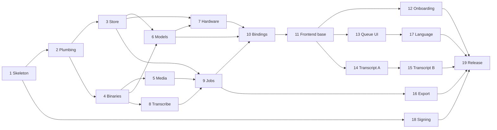

# Leneki Phase 1 Development Plan

**Status:** the build order for version 1.0.0
**Reads with:** [initial-plan.md](../initial-plan.md) for scope, [architecture/v1.0.0.md](../architecture/v1.0.0.md) for how the pieces fit together. This document turns those into work you can pick up one part at a time.

---

## How to use this document

The work is split into 19 parts. Each part is a self-contained unit with a stated goal, the parts it depends on, the files it creates, and a "done when" you can actually check. A part is finished when its done-when holds, not when the code compiles.

Parts are numbered in the recommended order, but the order is not strict. The **Depends on** line is the real constraint. The [part index](#part-index) shows which parts can run alongside each other.

Each part is sized S, M, or L. Those are relative weights, not time estimates. Two parts are L, and they are the two the initial plan warns about: the job queue and the transcript view.

---

## Before you start

### Toolchain

| Tool | Version | Why |
|---|---|---|
| Go | 1.25 or later | The core, and the floor set in `go.mod` |
| Node.js | 20 or later | Frontend build only, not shipped |
| Wails CLI | v2.9 or later | `go install github.com/wailsapp/wails/v2/cmd/wails@latest` |
| Platform toolchain | per OS | Xcode command line tools on macOS, WebView2 SDK on Windows, `libgtk-3-dev`, `libwebkit2gtk-4.1-dev` and `build-essential` on Linux |

Run `wails doctor` on each platform before Part 1. It reports missing native dependencies clearly and saves an hour of confusing build errors.

### Go dependencies

```
github.com/wailsapp/wails/v2
modernc.org/sqlite              pure Go SQLite, no cgo
github.com/shirou/gopsutil/v3   RAM and CPU detection
github.com/google/uuid          job IDs
```

Nothing else should be needed. If a fifth dependency looks necessary, check whether the standard library already covers it.

### Third party binaries to source

This is a procurement task, not a coding task, and it blocks [Part 4](#part-4-bundled-binaries). Do it first, because sourcing static builds for four platforms takes longer than expected.

For each of Windows x64, macOS ARM64, macOS x64, and Linux x64, obtain:

- `whisper-cli` from a pinned whisper.cpp release
- `ffmpeg` and `ffprobe` static builds

For each file, record the exact version, the download URL, and the SHA256. Put the license texts in `assets/licenses/`. The architecture document's [section 15](../architecture/v1.0.0.md#15-third-party-binaries-and-licensing) explains the obligations, and the short version is: ship both license texts and a written offer for FFmpeg's corresponding source.

### Decisions already made

Do not re-open these while building. They are settled in the architecture document's [section 21](../architecture/v1.0.0.md#21-decisions-locked).

Binaries embedded and extracted on first run. Segments stored as individual rows. Subtitle formatting ships in v1. One transcription job at a time. Playback from a separate Opus copy. `modernc.org/sqlite` as the driver. Word timings as a JSON column.

---

## Part index

| Part | Goal | Depends on | Size |
|---|---|---|---|
| [1](#part-1-walking-skeleton-and-ci) | Installable empty app on all four targets | none | M |
| [2](#part-2-core-plumbing) | Errors, events, paths, logging | 1 | S |
| [3](#part-3-store) | SQLite, migrations, repositories | 2 | M |
| [4](#part-4-bundled-binaries) | Extract and verify whisper and ffmpeg | 2 | M |
| [5](#part-5-media-intake) | Probe, convert, encode playback | 4 | M |
| [6](#part-6-model-management-backend) | Catalog, resumable download, verify | 3, 4 | M |
| [7](#part-7-hardware-and-benchmark) | Detect, benchmark, time estimates | 3, 4, 6 | S |
| [8](#part-8-transcription-runner) | One whisper run, parsed on both channels | 4 | M |
| [9](#part-9-job-queue-and-orchestration) | The pipeline end to end, headless | 3, 5, 8 | L |
| [10](#part-10-binding-layer-and-asset-route) | Everything callable from JavaScript | 6, 7, 9 | M |
| [11](#part-11-frontend-foundation) | Shell, routing, stores, event wiring | 10 | M |
| [12](#part-12-first-run-and-models-screen) | Onboarding and model management UI | 11 | M |
| [13](#part-13-home-and-queue-screens) | Add files, watch them run | 11 | M |
| [14](#part-14-transcript-view-part-a) | Segment list and audio playback | 11 | L |
| [15](#part-15-transcript-view-part-b) | Editing, find and replace, undo | 14 | L |
| [16](#part-16-export) | Four formats plus formatted subtitles | 9, 11 | M |
| [17](#part-17-language-handling) | Auto detect, override, translate | 13 | S |
| [18](#part-18-signing-and-notarization) | No security warnings on install | 1 | M |
| [19](#part-19-polish-and-release) | Ship it | all | M |

### What can run in parallel



Three things are worth knowing about this graph:

- **Parts 5, 6, and 8 are independent of each other.** Once Part 4 lands, they can be built in any order or at the same time.
- **Part 18 is independent of everything after Part 1.** Certificate procurement has a lead time, so start it early and land the code whenever the certificates arrive.
- **Part 10 is the seam.** Everything before it is Go with no user interface. Everything after it is mostly frontend. If two people are working, that is where the work splits cleanly.

---

## Part 1: Walking skeleton and CI

**Goal:** an installable application on all four targets that opens a window and calls one Go method.
**Depends on:** nothing.
**Size:** M

Distribution is solved first, deliberately. An application that is 90 percent complete and cannot be installed is 0 percent shipped, and packaging problems discovered in month three are the ones that stall projects.

### Files

```
go.mod  main.go  app.go  wails.json
frontend/                      scaffolded by the Wails template
build/windows/                 NSIS config, icon, manifest
build/darwin/                  Info.plist, icon
build/linux/                   AppImage build script and desktop entry
.github/workflows/build.yml
```

### Tasks

1. `wails init -n leneki -t svelte-ts` in the repository root.
2. Add one bound method, `Ping() string`, returning the app version. Call it from the Svelte page and render the result. This proves the binding layer works end to end.
3. Write the CI matrix: `windows-latest`, `macos-15` for ARM64, `macos-15-intel` for x64, `ubuntu-latest`. Intel macOS labels change often, so check the current one in `actions/runner-images` rather than copying an older project. A retired label does not fail, it queues forever.
4. Windows job: `wails build -platform windows/amd64 -nsis`, upload the installer.
5. macOS jobs: `wails build` for `darwin/arm64` and `darwin/amd64`, wrap each `.app` in a `.dmg`, upload.
6. Linux job: `wails build -platform linux/amd64`, then package as an AppImage with `linuxdeploy`, upload.
7. Install each artifact on a clean virtual machine. Note exactly which security warnings appear and what they say.

### Notes

Wails cannot cross compile. Each target must build on its own runner, because Wails binds to the native webview through cgo on macOS and Linux. This corrects the initial plan, and it is why the matrix has four entries rather than one.

Ubuntu 22.04 provides `webkit2gtk-4.0` and 24.04 provides `4.1`. The project targets 4.1 and builds with the `webkit2_41` tag, because the 22.04 runner image is being retired. Anyone building on 22.04 must drop the tag and install the 4.0 development package instead.

### Done when

All four artifacts install on a clean machine and show a window with the version string in it. Security warnings are expected at this stage and are removed in [Part 18](#part-18-signing-and-notarization). Write down what each warning says, because that text is what your users will see.

---

## Part 2: Core plumbing

**Goal:** the four small packages every other package imports.
**Depends on:** 1.
**Size:** S

### Files

```
internal/apperr/apperr.go      typed error
internal/apperr/codes.go       the code constants and their user messages
internal/events/emitter.go     Emitter interface
internal/events/recorder.go    test double that records emissions
internal/events/names.go       event name constants and payload structs
internal/config/paths.go       per OS directory resolution
internal/config/settings.go    settings shape and defaults
internal/logging/logging.go    slog to file and stderr
emitter.go                     the Wails implementation of events.Emitter
```

### Tasks

1. `apperr.Error` with `Code`, `Message`, and `Cause`. A `New(code, message)` constructor, `Wrap(err, code, message)`, and `From(err)` which returns the error unchanged if it is already an `apperr.Error` and otherwise produces `INTERNAL` with a generic message.
2. Define every code from the architecture's [error table](../architecture/v1.0.0.md#13-error-model) as a constant now, even though most have no call site yet. Having the list in one file is what keeps the messages consistent in tone.
3. `events.Emitter` is a one-method interface. The Wails implementation wraps `runtime.EventsEmit`. The recorder implementation appends to a slice for tests.
4. `config.Paths` resolves the data and cache directories per the architecture's [section 10](../architecture/v1.0.0.md#10-file-system-layout) and creates them if missing.
5. Logging writes to a size-capped file in the data directory, plus stderr during development.

Two things differ from the obvious reading of this list. The Wails implementation of `Emitter` lives in `emitter.go` at the repository root, not in `internal/events`, because a package that every service imports must not itself import the Wails runtime. And `settings.go` defines only the shape and defaults: settings are stored in the database, so reading and writing them arrives with the store in [Part 3](#part-3-store).

### Done when

`go test ./internal/...` passes, and the application logs its resolved data and cache paths at startup on Windows, macOS, and Linux, matching the table in the architecture document.

---

## Part 3: Store

**Goal:** a database that opens, migrates itself, and hands out repositories.
**Depends on:** 2.
**Size:** M

### Files

```
internal/store/store.go            open, migrate, hand out repositories
internal/store/migrations/*.sql    numbered, embedded from store.go
internal/store/jobs_repo.go
internal/store/segments_repo.go
internal/store/models_repo.go
internal/store/settings_repo.go
internal/store/store_test.go       open and migration behaviour
internal/store/repos_test.go       round trips
```

### Tasks

1. `Open(path)` opens the database, enables WAL mode and foreign keys, and runs migrations. Use a single writer connection to avoid busy timeouts.
2. Migrations are numbered SQL files embedded with `go:embed`, applied in order, tracked with `PRAGMA user_version`. No migration framework.
3. `0001_init.sql` is the schema from the architecture's [section 9](../architecture/v1.0.0.md#9-data-model), verbatim. Do not improvise on it here.
4. Repositories expose typed methods. No SQL leaves this package.
5. Refuse to open a database whose `user_version` is higher than the binary knows about, with a clear error rather than a corrupted file.

### Done when

Migrations apply cleanly to an empty file, every repository has a round-trip test that passes, and opening a database from a hypothetical future version fails with a readable message instead of proceeding.

---

## Part 4: Bundled binaries

**Goal:** whisper and ffmpeg present and verified on first run, with no user action.
**Depends on:** 2, and the sourcing task in [Before you start](#third-party-binaries-to-source).
**Size:** M

### Files

```
internal/binaries/binaries.go          Ensure, verify, extract
internal/binaries/embed_windows.go     build-tagged embeds
internal/binaries/embed_darwin.go
internal/binaries/embed_linux.go
internal/binaries/checksums.go         pinned SHA256 per file
assets/binaries/<platform>/            the executables themselves
assets/licenses/                       whisper.cpp and FFmpeg license texts
```

### Tasks

1. Embed the platform's three executables using build-tagged files, so a Windows build never carries the macOS binaries. Getting this wrong triples the installer size.
2. `Ensure(cacheDir)` extracts to `<cache>/bin/` if absent, sets the executable bit on Unix, verifies SHA256, and returns absolute paths.
3. Verify on every launch, not only on extraction. A partial or corrupted extract should re-extract itself rather than failing later with a confusing error from a child process.
4. Commit the licenses now, while the versions are fresh in mind.

### Done when

On a machine with an empty cache directory, first launch extracts all three files and `ffmpeg -version` runs successfully from the returned path. Deliberately truncating an extracted file causes a clean re-extraction on the next launch.

---

## Part 5: Media intake

**Goal:** any file the user drops is either understood or rejected with a sentence they can act on.
**Depends on:** 4.
**Size:** M

### Files

```
internal/media/probe.go
internal/media/convert.go
internal/media/playback.go
internal/media/errors.go
internal/media/media_test.go
testdata/                     fixture media
```

### Tasks

1. `Probe` runs `ffprobe` with JSON output and returns duration, audio stream list, codecs, and sample rate. It runs before anything expensive, always.
2. `ConvertForTranscription` produces 16kHz mono WAV into `<cache>/temp/<jobID>/audio.wav`.
3. `EncodePlayback` produces 32kbps mono Opus in WebM into `<data>/playback/<jobID>.webm`. This is what the transcript player uses, and it exists because the WAV gets deleted and because WebKitGTK often cannot decode AAC or H.264.
4. Map every failure to a code from Part 2: no audio stream, corrupt container, DRM protected, unsupported format, insufficient disk space. Check free space against roughly 115MB per hour of audio before converting, not after failing.
5. Default to the first audio track when a file has several, and return the full list so the interface can offer a choice.

### Fixtures

Commit six small files to `testdata/`: a normal MP4, an M4A, an MP3, a video-only MP4, a truncated file, and a file with two audio tracks. Keep each to a few seconds.

### Done when

All six fixtures produce the correct outcome, and each failure carries a code and a message a non-technical person could act on. No failure surfaces an ffmpeg exit code.

---

## Part 6: Model management backend

**Goal:** download, verify, switch, and delete models without ever leaving a broken file in place.
**Depends on:** 3, 4.
**Size:** M

### Files

```
internal/models/catalog.go      static model specs
internal/models/download.go     resumable, verified
internal/models/manage.go       list, delete, free space
internal/models/models_test.go
```

### Tasks

1. The catalog is compiled-in static data: name, URL, byte size, SHA256, approximate RAM requirement, relative speed factor. Use the table in the initial plan as the starting values.
2. `Download` resumes with HTTP `Range` requests against a `.part` file, emits progress throttled to about 4 events per second, verifies SHA256 on completion, and only then moves the file into place. A partial file must never be usable as a model.
3. `Delete` refuses when the model is the one currently selected or in use by a running job.
4. `FreeSpace` is checked before a download starts, against the model's size plus a margin.
5. Never bundle model weights in the installer.

### Done when

An interrupted download resumes rather than restarting, a deliberately corrupted download is rejected at the verification step, and deleting an in-use model is refused with a clear message.

---

## Part 7: Hardware and benchmark

**Goal:** tell the user, in their terms, how long this will take on this machine.
**Depends on:** 3, 4, 6.
**Size:** S

### Files

```
internal/hardware/detect.go
internal/hardware/detect_darwin.go     sysctl, Apple Silicon, Metal
internal/hardware/detect_other.go      nvidia-smi parsing
internal/hardware/benchmark.go
internal/hardware/estimate.go
assets/bench-sample.wav                30 seconds of speech
```

### Tasks

1. Detect total and available RAM with gopsutil, core count with `runtime.NumCPU()`, and GPU per platform. Fall back to CPU-only cleanly when detection fails, rather than erroring.
2. Build a machine fingerprint from CPU model, core count, and GPU identity. Cache the benchmark against it, and re-run when it changes.
3. `Benchmark` transcribes the bundled 30 second sample with the `base` model and measures the real-time factor for this machine. Twenty seconds of measurement beats any amount of spec sheet reading.
4. `Estimate` extrapolates to other models using the catalog's relative speed factors.
5. Produce estimates in user-facing language. "About 6 minutes per hour of audio", not "8GB RAM detected, recommending small".

### Done when

First launch produces an RTF in a plausible range, and estimates for every catalog model render as sentences. The recommendation is a preselection, never a lock: the user can pick any model that fits in their RAM.

---

## Part 8: Transcription runner

**Goal:** run whisper once, correctly, and read its output on both channels.
**Depends on:** 4.
**Size:** M

### Files

```
internal/transcribe/run.go
internal/transcribe/args.go        command construction
internal/transcribe/stdout.go      live line parser
internal/transcribe/result.go      JSON output reader
internal/transcribe/transcribe_test.go
testdata/whisper-stdout.txt        captured real output
testdata/whisper-output.json
```

This package knows nothing about queues, databases, or other jobs. That is what makes the largest part of the project testable in pieces.

### Tasks

1. Build the command: model path, input WAV, JSON output enabled, thread count, language, translate flag.
2. Run with `exec.CommandContext` so cancellation is a process kill.
3. Parse stdout line by line for live segments, in the form `[00:00:12.400 --> 00:00:16.120]   text`. Call the `onSegment` callback as each arrives. This channel is for perceived responsiveness and is allowed to be approximate.
4. On clean exit, read the JSON output file. This is the authoritative record, carrying exact timings, word level timestamps, and the detected language. It replaces whatever the live channel produced.
5. Map exit conditions to codes. Detect out-of-memory aborts specifically, because "try a smaller model" is actionable and "transcription failed" is not.

### Done when

The captured fixture output parses correctly in unit tests with no binaries present, a real 30 second clip transcribes end to end, and cancelling mid-run leaves no orphan process. Check the process table, do not assume.

---

## Part 9: Job queue and orchestration

**Goal:** the whole pipeline, running unattended, surviving a crash.
**Depends on:** 3, 5, 8.
**Size:** L

This is the first of the two large parts. It is also the last part with no user interface, which means it can be fully tested in `go test` before a single pixel exists.

### Files

```
internal/jobs/queue.go        worker loop, add, reorder
internal/jobs/state.go        state machine and transitions
internal/jobs/run.go          orchestration: probe, convert, encode, transcribe, persist
internal/jobs/recover.go      startup recovery and temp sweep
internal/jobs/batch.go        segment event batching
internal/jobs/jobs_test.go
```

### Tasks

1. Implement the state machine from the architecture's [section 8](../architecture/v1.0.0.md#8-job-lifecycle). Write state to the database before emitting the corresponding event, never the other way around.
2. One worker goroutine, one job at a time. Multi-thread within the job by passing `-t` to whisper.
3. Store each running job's `context.CancelFunc` in its record so cancel and pause work from any goroutine.
4. Pause on a running job cancels it and returns it to `queued`, because whisper cannot be suspended mid-inference. Say so plainly in the interface later.
5. Batch segment events: flush every 100 milliseconds or every 25 segments, whichever comes first. A four hour file produces thousands of segments, and unbatched they cause visible jank in the webview.
6. Persist all segments from the JSON result in one transaction, then mark the job done.
7. `Recover` at startup returns any job left in `converting` or `transcribing` to `queued`, then sweeps the temp directory for orphans.
8. On cancel: kill the process, delete temp files, mark cancelled.

### Done when

A queue of mixed files runs to completion unattended with a recording emitter capturing the events. Killing the process mid-job and restarting recovers the queue with no orphan temp files and no orphan processes. Cancelling a job mid-transcription leaves neither.

---

## Part 10: Binding layer and asset route

**Goal:** every backend capability reachable from JavaScript, and audio streaming with seek support.
**Depends on:** 6, 7, 9.
**Size:** M

### Files

```
app.go                        every bound method
internal/media_route.go       /media/{jobID} handler
main.go                       wiring, asset server registration
```

### Tasks

1. Implement the bound methods listed in the architecture's [section 11](../architecture/v1.0.0.md#11-frontend-and-backend-contract). Each one validates its arguments, calls exactly one service, and translates the error. No logic here.
2. Register a custom asset handler at `/media/{jobID}` that resolves the job's `playback_path` and serves it with `http.ServeContent`. That gives range request support, which is what makes seeking work and what keeps the file streaming from disk rather than loading into memory.
3. Confirm Wails regenerates the TypeScript bindings, and commit them, so the frontend has a checked contract.

### Done when

Every bound method can be called from the webview developer console and returns the expected shape. A range request against `/media/{jobID}` returns HTTP 206 with the correct byte range.

---

## Part 11: Frontend foundation

**Goal:** the shell every screen plugs into, and an early answer on Linux.
**Depends on:** 10.
**Size:** M

### Files

```
frontend/src/routes/            one file per screen, initially stubs
frontend/src/lib/               shared components
frontend/src/stores/            jobs, activeJob, segments, models, machine, settings
frontend/src/api/               typed wrappers over generated bindings
frontend/src/app.css            design tokens
```

### Tasks

1. Routing and a layout shell covering the seven screens from the architecture's [section 12](../architecture/v1.0.0.md#12-frontend-architecture). Screens can be stubs.
2. Stores that subscribe to their events on mount and reconcile. No store writes to disk. Every mutation goes through a bound method and is confirmed by the resulting event.
3. A single error surface: any `apperr` coming back from a bound method shows the same toast, using the message the backend supplied. Never invent error text in the frontend.
4. Design tokens for colour, spacing, and type. Small, but decided once here rather than renegotiated on every screen.

### Risk checkpoint

Run the shell on Linux under WebKitGTK now, in this part, not in month three. The initial plan flags this as a risk for good reason: WebKitGTK is the slowest of the three engines and has the most layout quirks. Finding a problem here costs a day. Finding it in [Part 14](#part-14-transcript-view-part-a) costs a week.

### Done when

The application runs on all three platforms, navigation works, one store round-trips real data from the backend, and a deliberately triggered backend error shows a readable toast.

---

## Part 12: First run and models screen

**Goal:** a new user gets from install to their first transcription without confusion.
**Depends on:** 11.
**Size:** M

### Tasks

1. First run wizard: welcome, run the benchmark with a progress indicator, present the recommendation with honest time estimates, download the chosen model with progress and a cancel button.
2. Models screen: every catalog model with installed state, size, RAM requirement, and estimated time per hour of audio on this machine. Install, delete, and select.
3. Show free disk space before a download, and refuse to start one that does not fit.
4. Note in the interface that laptops on battery may run slower than the benchmark suggests.

### Done when

A user with an empty data directory can go from first launch to a downloaded, selected model without reading documentation, and every number on screen is expressed in minutes rather than model sizes.

---

## Part 13: Home and queue screens

**Goal:** add files and watch them run.
**Depends on:** 11.
**Size:** M

### Tasks

1. Drop zone accepting multiple files, plus a file picker for people who do not drag.
2. Probe each dropped file immediately and reject unusable ones at the drop, with the reason, rather than letting them sit in the queue and fail later.
3. Queue list with per-job state, progress bar, time remaining, and per-job pause, cancel, reorder, and delete.
4. Track selection for files with more than one audio stream.
5. Live segment text appearing during transcription, so a long job visibly progresses.

### Done when

Fifteen files can be dropped at once, they run in sequence unattended, and progress and live text update smoothly on all three platforms.

---

## Part 14: Transcript view, part A

**Goal:** the segment list and the audio player, working together.
**Depends on:** 11.
**Size:** L

This screen is the product. The initial plan says to budget more time for it than feels reasonable, and that is correct. It is split across two parts so the first half can be reviewed before the second begins.

### Tasks

1. Virtualized segment list rendering only the visible window plus a margin. Rows are editable and therefore variable height, so measure rendered heights and cache them, using an estimate for unmeasured rows.
2. Timestamp on every segment.
3. An `<audio>` element pointed at `/media/{jobID}`.
4. Clicking a segment seeks playback to its start.
5. The current segment is highlighted during playback and scrolled into view, unless the user has scrolled away deliberately.

### Done when

A four hour transcript, roughly 3,000 segments, scrolls smoothly on all three platforms including WebKitGTK, and clicking a segment 90 minutes in seeks immediately rather than stalling.

---

## Part 15: Transcript view, part B

**Goal:** editing that people trust with hours of work.
**Depends on:** 14.
**Size:** L

### Tasks

1. Inline editable text, autosaved with a 500 millisecond debounce through `UpdateSegment`, which sets the segment's `edited` flag.
2. Find and replace across the whole transcript through `ReplaceAll`, which does the work in one backend transaction rather than one update per match.
3. Undo and redo as a frontend command stack, scoped to the open job and cleared when it closes.
4. Keyboard shortcuts: play and pause, skip back 5 seconds, next and previous segment.
5. A visible saved indicator, because autosave without feedback makes people nervous about closing the window.

### Why find and replace is not optional

Correcting a name that whisper misspelled forty times is the single most common task after transcription. Without it, users finish the job in a text editor, and then they have no reason to come back.

### Done when

Someone can transcribe an interview, correct every misspelled name in one operation, navigate the audio by clicking text, undo a mistake, and close the window without losing an edit made one second earlier.

---

## Part 16: Export

**Goal:** four formats, plus subtitles that are actually usable.
**Depends on:** 9, 11.
**Size:** M

### Files

```
internal/export/txt.go
internal/export/srt.go
internal/export/vtt.go
internal/export/json.go
internal/export/cues.go        RawCues and FormatCues
internal/export/export_test.go
```

### Tasks

1. TXT with optional timestamps, SRT, VTT, and JSON with word level timings. Do not skip the JSON export: it is what makes Leneki useful to people building on its output.
2. `RawCues` produces one cue per segment. `FormatCues` re-breaks segments into cues with character-per-line caps, minimum and maximum durations, reading speed limits, and break points at punctuation. Both feed the same SRT and VTT writers.
3. Export dialog offering raw or formatted subtitles, since v1 targets journalists and video editors both.
4. Copy the full transcript to the clipboard, and remember the last used export directory.

### Done when

All four formats export correctly, the SRT loads in VLC with no errors, and the formatted variant respects its line length and duration limits on a real transcript rather than only on a fixture.

---

## Part 17: Language handling

**Goal:** make the ninety plus language support visible, because it is a genuine advantage over English-first commercial tools.
**Depends on:** 13.
**Size:** S

### Tasks

1. Auto-detect by default, using whisper's own detection.
2. Manual override with a searchable language list.
3. Translate-to-English toggle, which whisper does natively.
4. Display the detected language on the job and in the transcript view, so a user can catch a wrong detection instead of wondering why the output is nonsense.

### Done when

A non-English recording transcribes correctly with auto-detect, the detected language is visible, and forcing the wrong language visibly changes the result, which proves the flag is actually reaching whisper.

---

## Part 18: Signing and notarization

**Goal:** installation with no security warnings.
**Depends on:** 1. Independent of everything else.
**Size:** M

Start the procurement early. Certificates have lead times measured in days or weeks, and this part cannot be finished without them.

### Tasks

1. **macOS:** sign with a Developer ID certificate, notarize with `notarytool`, staple the ticket. Without notarization, Gatekeeper refuses to open the application at all on a default configuration, so this is not optional on macOS.
2. **Windows:** sign the installer. An Organization Validation certificate builds SmartScreen reputation over time. An Extended Validation certificate bypasses the warning immediately and costs more. This is a budget decision, not a technical one.
3. Store credentials as CI secrets. Never in the repository.
4. Re-test on clean virtual machines, because the build machine never reproduces the warnings.

### Done when

A non-technical person can install on all four platforms and sees no security warning at any point.

---

## Part 19: Polish and release

**Goal:** the difference between working software and shippable software.
**Depends on:** everything.
**Size:** M

### Tasks

1. Empty states on every screen, and first-run guidance that does not assume prior knowledge.
2. A full pass over every error message, read as if by someone who does not know what a codec is. This is the moment to fix any message that leaked a technical term.
3. Crash recovery verified from the user's side: force quit mid-queue, relaunch, confirm the queue is intact and the interface explains what happened.
4. Settings: model directory, temp directory, thread count, re-run benchmark.
5. About screen with version, license, and third party attributions for whisper.cpp, FFmpeg, and the model weights.
6. README with screenshots, per-platform install instructions, and the Linux `libwebkit2gtk` dependency named explicitly for both Ubuntu 22.04 and 24.04.
7. Tag v1.0.0 and publish the four artifacts.

### Done when

The Phase 1 definition of done below holds, verified on a clean machine on each platform, by someone who did not write the code.

---

## Phase 1 definition of done

From the initial plan, unchanged, and this is the only test that matters:

> Someone can install the application, drop in a Zoom recording, get an accurate editable transcript, fix a few words, and export an SRT.

Concretely, on a clean machine on each of the four targets:

1. Install with no security warning.
2. First launch benchmarks the machine and recommends a model with an honest time estimate.
3. Download the model, with resume working if the connection drops.
4. Drop in an MP4 and watch text appear while it runs.
5. Click a line of text and hear that moment of audio.
6. Fix a misspelled name everywhere in one operation.
7. Export SRT and open it in VLC.
8. Force quit mid-queue, relaunch, and find the queue intact.

---

## Progress checklist

- [ ] Binaries sourced, pinned, checksummed, licenses committed
- [x] Part 1: Walking skeleton and CI
- [x] Part 2: Core plumbing
- [ ] Part 3: Store
- [ ] Part 4: Bundled binaries
- [ ] Part 5: Media intake
- [ ] Part 6: Model management backend
- [ ] Part 7: Hardware and benchmark
- [ ] Part 8: Transcription runner
- [ ] Part 9: Job queue and orchestration
- [ ] Part 10: Binding layer and asset route
- [ ] Part 11: Frontend foundation, including the Linux checkpoint
- [ ] Part 12: First run and models screen
- [ ] Part 13: Home and queue screens
- [ ] Part 14: Transcript view, part A
- [ ] Part 15: Transcript view, part B
- [ ] Part 16: Export
- [ ] Part 17: Language handling
- [ ] Part 18: Signing and notarization
- [ ] Part 19: Polish and release
